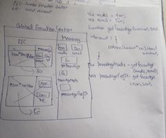
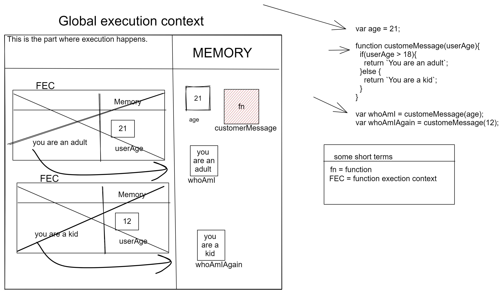

1. What does thread of execution means in JavaScript?
```js
//When you want to execute a piece of code javascript engine takes this code execute line by line that is also known as thread of execution.
```

2. Where the JavaScript code gets executed?
```js
//The javascript code executed in the Javascript Engine.
```

3. What does context means in Global Execution Context?
```js
// Context is an environment in which you are executing the code. so here a javascript engine does at first is creting a global execution context.
```

4. When do you create a global execution context.
```js
// At first a javascript engine does as soon as you execute a code snippet the javascript engine create a global execution context.
```

5. Execution context consists of what all things?
```js
// 1. Where you are going to store all the data and variables function extra.
// 2. Where execution happens things like operation, manupulation etc. 
```

6. What are the different types of execution context?
```js 
 //There are two types execution context.
 // 1. Global execution context it is only creted once through out the program.
 // 2. The other one is known as function execution context that gets created whenever you are executing any function. 
```

7. When global and function execution context gets created?
```js 
//global execution contextgets created whenever a piece of code gets executed .
// function execution context get created whenever you are executing any function. 

```

8. Function execution gets created during function execution or while declaring a function.

<!-- Function execution gets created during function execution  -->

9. Create a execution context diagram of the following code on your notebook. Take a screenshot/photo and store it in the folder named `img`. Use `` to display it here.


```js
var user = "Arya";

function sayHello(){
  return `Hello ${user}`;
}

var userMsg = sayHello(user);
```

<!-- Put your image here -->


 ```js
var marks = 400;
var total = 500;

function getPercentage(amount, totalAmount){
  return (amount * 100) / totalAmount;
}

var percentageMarks = getPercentage(marks, total);
var percentageProfit = getPercentage(400, 200);
```

<!-- Put your image here -->




```js
var age = 21;

function customeMessage(userAge){
  if(userAge > 18){
    return `You are an adult`;
  }else {
    return `You are a kid`;
  }
}

var whoAmI = customeMessage(age);
var whoAmIAgain = customeMessage(12);
```

<!-- Put your image here -->

